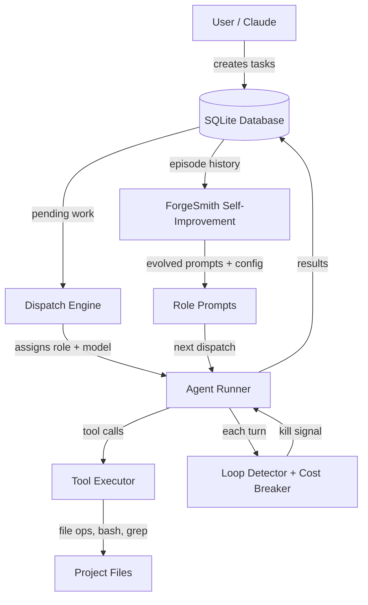
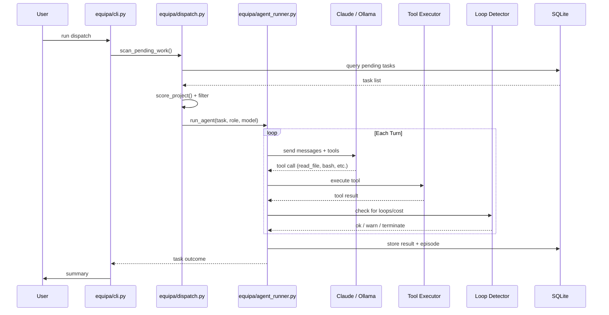
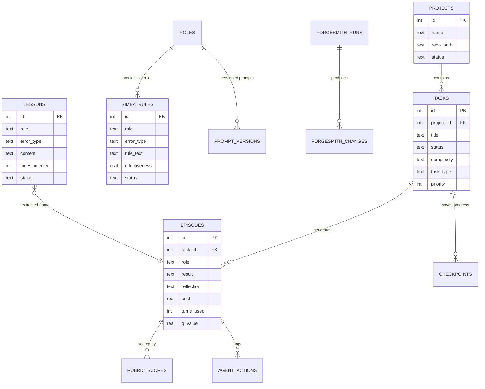

# ARCHITECTURE.md — EQUIPA

## Table of Contents

- [ARCHITECTURE.md — EQUIPA](#architecturemd-equipa)
  - [How It Works](#how-it-works)
  - [System Overview](#system-overview)
  - [Data Flow](#data-flow)
  - [Database](#database)
  - [Project Structure](#project-structure)
  - [Key Design Decisions](#key-design-decisions)
    - [Zero dependencies](#zero-dependencies)
    - [SQLite as the backbone](#sqlite-as-the-backbone)
    - [Anti-compaction state persistence](#anti-compaction-state-persistence)
    - [The LoopDetector is aggressive](#the-loopdetector-is-aggressive)
    - [Cost breakers scale with complexity](#cost-breakers-scale-with-complexity)
    - [Self-improvement is a closed loop, not a one-shot](#self-improvement-is-a-closed-loop-not-a-one-shot)
    - [Language-aware prompts](#language-aware-prompts)
    - [Lesson sanitization](#lesson-sanitization)
    - [Ollama support for local models](#ollama-support-for-local-models)
  - [Current Limitations](#current-limitations)
  - [Related Documentation](#related-documentation)

## How It Works

You have a project. You have tasks in a SQLite database. EQUIPA picks up those tasks, figures out which agent role should handle each one (developer, tester, security reviewer, etc.), and dispatches AI agents to do the work.

Here's what actually happens when you run it:

1. **You describe work** — tasks go into the SQLite database, either through Claude conversation or directly. Each task has a project, priority, complexity, and type.

2. **Dispatch picks what to work on** — `equipa/dispatch.py` scans for pending work, scores projects by priority and staleness, and decides what to tackle next. It can run multiple tasks in parallel via async.

3. **An agent gets assigned** — based on the task type and complexity, EQUIPA picks a role (developer, tester, security reviewer, planner, evaluator, etc. — 9 roles total). Each role has its own system prompt, and those prompts are language-aware. If your project is Python, the developer gets Python-specific guidance. TypeScript? Same deal.

4. **The agent works in a loop** — the agent reads files, runs commands, writes code, runs tests. Each turn it picks a tool (read_file, write_file, bash, grep, etc.) and EQUIPA executes it in a sandboxed-ish way with path validation. The agent keeps going until it finishes, gets stuck, or hits a cost/turn limit.

5. **Dev-test iteration** — this is the important part. If the developer writes code and tests fail, EQUIPA feeds the test output back and the developer tries again. This retry loop continues until tests pass or the budget runs out. The tester role can also run independently to verify work.

6. **Monitoring kills runaway agents** — there's a `LoopDetector` that fingerprints each turn's output. If the agent produces the same output 3+ times, it gets a warning, then gets killed. Monologue detection catches agents that just talk without using tools. Cost breakers kill agents that burn too much money. Early termination fires if the agent says stuck-sounding phrases like "I'm unable to" for too long.

7. **Results get recorded** — everything goes back to the database. Task status, agent output, files changed, cost, turn count, rubric scores, reflections. This history is what powers the self-improvement loop.

8. **ForgeSmith learns from the results** — this is the closed-loop part. ForgeSmith runs periodically (cron or manual), looks at recent agent performance, extracts lessons from failures, and adjusts prompts and config. Three subsystems handle this:
   - **GEPA** (Genetic-Episodic Prompt Adaptation) — evolves agent prompts based on success/failure patterns
   - **SIMBA** — generates tactical rules from failure analysis ("when you see X error, try Y")
   - **ForgeSmith core** — adjusts config values like max_turns, model assignments, and cost limits

The whole thing is self-contained. One SQLite database. Pure Python stdlib. No pip install required. Copy the files, set up the database, go.

---

## System Overview



---

## Data Flow

A typical task dispatch, from trigger to completion:



---

## Database

EQUIPA uses a 30+ table SQLite schema. Here are the key entities:



---

## Project Structure

```
equipa/                     # Core package — the orchestration engine
├── cli.py                  # Entry point. Parses args, kicks off dispatch
├── dispatch.py             # Picks tasks, scores projects, runs parallel dispatch
├── agent_runner.py         # Runs a single agent session (async subprocess)
├── tasks.py                # Task fetching, complexity detection, project resolution
├── db.py                   # Database connection, schema setup, error classification
├── monitoring.py           # LoopDetector, cost breakers, budget warnings
├── lessons.py              # Lesson + SIMBA rule injection into agent prompts
├── messages.py             # Inter-agent messaging (post/read/mark-read)
├── prompts.py              # Checkpoint context builder
├── parsing.py              # Output parsing — reflections, test results, Q-values
├── output.py               # Pretty printing dispatch summaries
├── preflight.py            # Pre-task health checks (npm install, pip install, etc.)
├── checkpoints.py          # Anti-compaction state persistence
├── security.py             # Content wrapping, skill manifest integrity
├── git_ops.py              # Language detection, repo setup, gh CLI checks
├── manager.py              # Planner/evaluator output parsing

ollama_agent.py             # Local model support — tool execution, Ollama API calls
rubric_quality_scorer.py    # Scores agent output on 5 dimensions (0-10 each)

forgesmith.py               # Main self-improvement engine — lessons, config changes, OPRO
forgesmith_gepa.py          # GEPA — evolves prompts via episodic success/failure data
forgesmith_simba.py         # SIMBA — generates tactical rules from failure patterns
forgesmith_impact.py        # Blast radius analysis for config/prompt changes
forgesmith_backfill.py      # Backfills episode data from agent logs
lesson_sanitizer.py         # Sanitizes lesson content (strips injection attacks, etc.)

nightly_review.py           # Daily summary report — blockers, stale tasks, agent stats
analyze_performance.py      # Historical performance analysis and reporting
autoresearch_loop.py        # Automated prompt optimization loop (dispatch + measure)
autoresearch_prompts.py     # OPRO-style prompt mutation via Claude/Ollama

db_migrate.py               # Schema migrations (v0 → v4)
equipa_setup.py             # Interactive setup wizard

tools/                      # Standalone utilities
├── forge_dashboard.py      # Terminal dashboard for task/project status
├── forge_arena.py          # Multi-phase stress testing for agents
├── prepare_training_data.py # Exports agent episodes as LoRA training data
├── ingest_training_results.py
├── benchmark_migrations.py # Migration speed/correctness benchmarks

tests/                      # 334+ tests
├── test_early_termination.py   # Loop detection, cost breakers, monologue detection
├── test_loop_detection.py      # Fingerprinting, tool loops, alternating patterns
├── test_forgesmith_simba.py    # SIMBA rule generation and pruning
├── test_lesson_sanitizer.py    # Injection prevention
├── test_episode_injection.py   # Q-value filtering, cross-project fallback
├── test_language_detection.py  # Project language/framework detection
├── ...

skills/                     # Agent skill definitions
├── security/               # SARIF parsing helpers for security review

prompts/                    # Role-specific system prompts (language-aware variants)
```

---

## Key Design Decisions

### Zero dependencies
Everything uses Python stdlib. No pip, no venv, no version conflicts. You copy the files and run them. This matters because EQUIPA often runs on remote machines, CI environments, or alongside other projects. Dependency conflicts are just not a thing.

### SQLite as the backbone
One file. No server. Easy to back up (it's just a file). The 30+ table schema is a lot, but it means all state — tasks, episodes, lessons, prompts, agent actions, SIMBA rules — lives in one place. ForgeSmith can query recent history and make decisions without juggling multiple data stores.

### Anti-compaction state persistence
Long-running agent tasks (20+ turns) lose context when the conversation gets compacted. EQUIPA writes checkpoints to disk so if an agent session gets interrupted or the context window fills up, it can resume with the important bits intact. This is a direct response to agents "forgetting" what they were doing mid-task.

### The LoopDetector is aggressive
Agents get stuck. A lot. The `LoopDetector` fingerprints every turn and catches: consecutive identical outputs, tool call loops (same tool with same args), alternating patterns (A→B→A→B), and monologuing (text without tool use). It warns first, then kills. This wastes some turns on warnings, but it's way better than burning 50 turns on an agent talking to itself.

### Cost breakers scale with complexity
A simple task gets a small cost limit. A complex task gets more room. The limits are configurable per-role in the dispatch config. This prevents a confused agent on a trivial task from burning $5 while still giving complex tasks the budget they need.

### Self-improvement is a closed loop, not a one-shot
ForgeSmith → GEPA → SIMBA form a feedback cycle. Episodes get scored. Scores inform prompt evolution. Evolved prompts produce new episodes. SIMBA watches for specific failure patterns and generates targeted rules. Rules get evaluated and pruned if they don't help. It's not fast — you need 20-30 tasks before patterns emerge — but it does converge.

### Language-aware prompts
A developer agent working on a Go project gets different guidance than one working on TypeScript. `detect_project_language()` checks for marker files (go.mod, tsconfig.json, pyproject.toml, etc.) and loads the appropriate prompt variant. This matters because "run the tests" means very different things across ecosystems.

### Lesson sanitization
Lessons extracted from agent episodes get injected into future prompts. That's a prompt injection vector. `lesson_sanitizer.py` strips XML tags, base64 payloads, ANSI escapes, dangerous code blocks, and role-override phrases before anything gets stored or injected. It's paranoid by design.

### Ollama support for local models
`ollama_agent.py` implements the full tool-calling loop against local Ollama models. Same tools, same sandboxing, same monitoring. You can run the whole system without API keys if you have a capable local model. The tool execution layer (read_file, write_file, bash, grep, etc.) is shared between Claude and Ollama paths.

---

## Current Limitations

- **Agents still get stuck on complex tasks.** Analysis paralysis is real — an agent will sometimes read the same 10 files for 8 turns before writing anything. The early termination at 10 turns of reading-only catches this, but some legitimate complex tasks genuinely need that exploration time.

- **Git worktree merges occasionally need manual intervention.** Worktree isolation keeps agents from stepping on each other, but merge conflicts after parallel work still happen. You'll need to resolve those yourself sometimes.

- **Self-improvement needs 20-30 tasks to show results.** GEPA and SIMBA need a meaningful episode history before they can identify patterns. On a fresh install, ForgeSmith doesn't have enough data to do anything useful.

- **Tester role depends on project having a working test suite.** If your project doesn't have tests, or the test runner is broken, the dev-test iteration loop can't close. The tester will just report failures that aren't actionable.

- **Early termination can be overzealous.** The 10-turn reading-only kill is a heuristic. Some tasks — especially large refactors or security audits — legitimately need more exploration before action. The threshold is configurable but the default is conservative.

- **Agents still fail, get stuck, and waste turns.** This is not magic. A dispatched task might take 3 attempts. An agent might monologue for 5 turns before the detector kills it. Success rates improve over time with the self-improvement loop, but expect imperfection, especially early on.
---

## Related Documentation

- [Readme](README.md)
- [Api](API.md)
- [Deployment](DEPLOYMENT.md)
- [Contributing](CONTRIBUTING.md)
