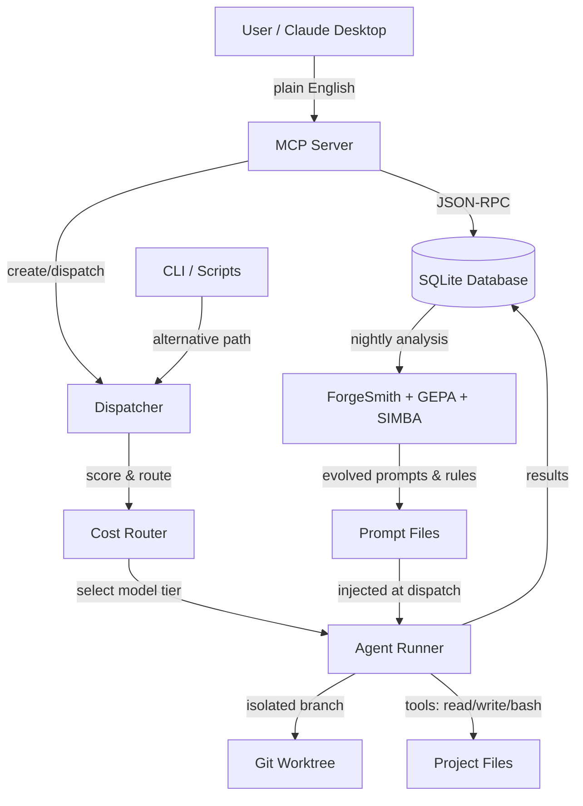
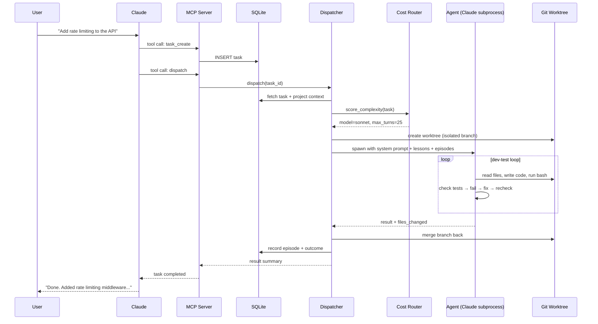
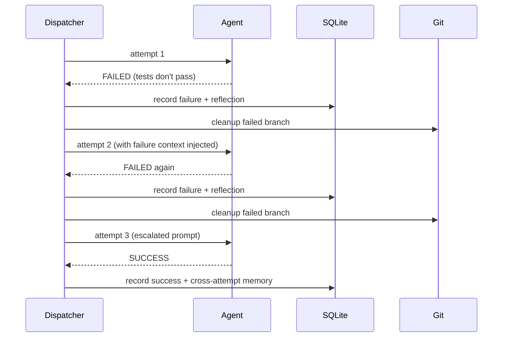
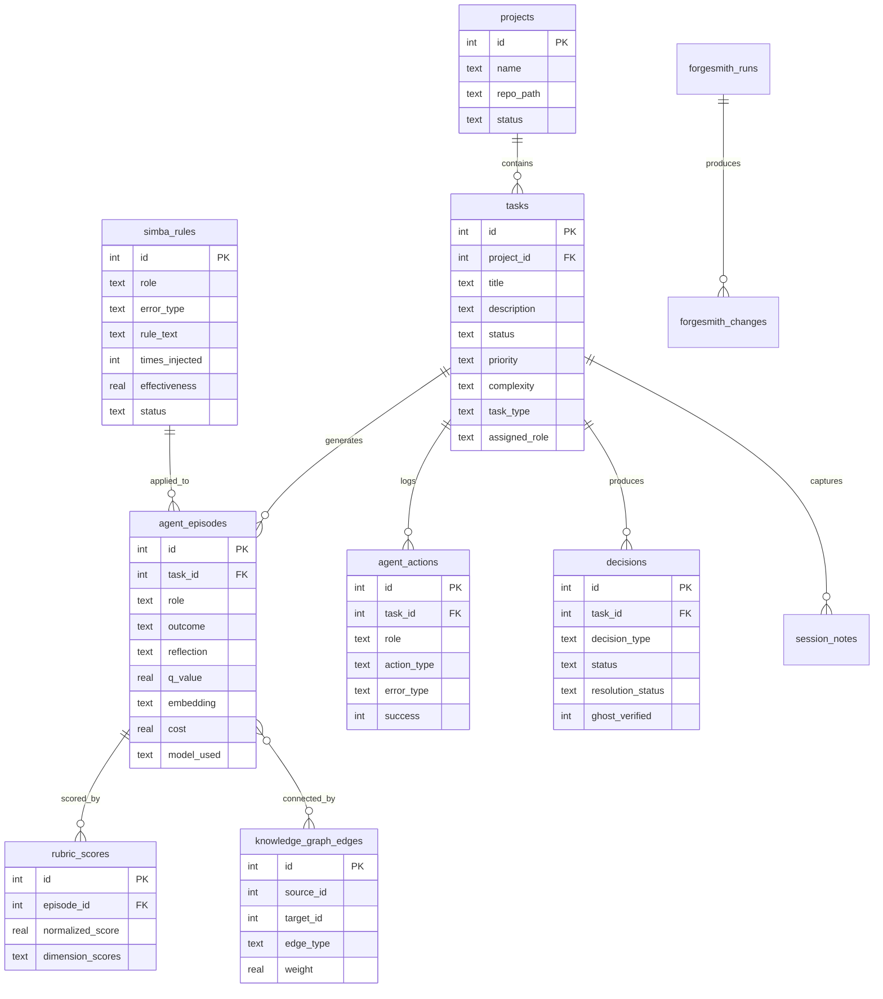

# ARCHITECTURE.md

## Table of Contents

- [ARCHITECTURE.md](#architecturemd)
  - [How It Works](#how-it-works)
    - [What happens when you give it a task](#what-happens-when-you-give-it-a-task)
  - [System Overview](#system-overview)
  - [Data Flow](#data-flow)
    - [Typical task dispatch (conversational)](#typical-task-dispatch-conversational)
    - [Autoresearch retry loop (on failure)](#autoresearch-retry-loop-on-failure)
  - [Database](#database)
  - [Project Structure](#project-structure)
  - [Key Design Decisions](#key-design-decisions)
    - [Zero dependencies](#zero-dependencies)
    - [Conversational-first via MCP](#conversational-first-via-mcp)
    - [Prompt cache splitting (PromptResult)](#prompt-cache-splitting-promptresult)
    - [Git worktree isolation](#git-worktree-isolation)
    - [Episodic memory with Q-values](#episodic-memory-with-q-values)
    - [Bash security filter](#bash-security-filter)
    - [Cost controls that actually kill agents](#cost-controls-that-actually-kill-agents)
    - [Anti-compaction state persistence](#anti-compaction-state-persistence)
    - [Retry with exponential backoff](#retry-with-exponential-backoff)
    - [Early termination for stuck agents](#early-termination-for-stuck-agents)
    - [REPL sandbox for decomposition](#repl-sandbox-for-decomposition)
    - [Cross-platform scheduling](#cross-platform-scheduling)
  - [Current Limitations](#current-limitations)
  - [Related Documentation](#related-documentation)

## How It Works

EQUIPA is a multi-agent orchestrator that coordinates AI agents to write, test, review, and secure code. Here's the important thing to understand upfront:

**Most users never touch a CLI.** The primary way to use EQUIPA is conversational — you talk to Claude (or another AI assistant) in plain English. "Add pagination to the users API." Claude figures out how to break that into tasks, dispatches EQUIPA agents, monitors their progress, and reports back what happened. The MCP server makes this possible by giving Claude direct access to EQUIPA's tools.

For automation and scripting, there's a CLI too. But the conversational model is how most people use it day to day.

### What happens when you give it a task

1. You describe what you want in plain English to Claude.
2. Claude creates a task in EQUIPA's SQLite database via the MCP server.
3. The dispatcher picks it up, scores its complexity, and routes it to the right model tier (Haiku for simple stuff, Sonnet for medium, Opus for hard).
4. A specialized agent gets the task — could be a developer, tester, security reviewer, code reviewer, or one of 5 other roles. Each role has its own system prompt, tuned for that job.
5. The agent works in a git worktree (isolated branch), reads files, writes code, runs tests. If tests fail, it loops — dev writes, tester checks, dev fixes, repeat until tests pass or the budget runs out.
6. When done, the agent's work gets merged back. Results go into the database. Lessons get extracted for next time.

Behind the scenes, three systems continuously improve the agents:

- **ForgeSmith** analyzes past runs nightly, tweaks config values, patches prompts, and rolls back changes that made things worse.
- **GEPA** (Guided Evolutionary Prompt Architecture) evolves the system prompts using A/B testing against real task performance.
- **SIMBA** (Situation-Informed Memory-Based Adaptation) generates tactical rules from failure patterns — "when you see error X in language Y, try Z first."

These form a closed loop. Agents do work → results get recorded → overnight analysis finds patterns → prompts and configs get tweaked → agents do better work. It takes 20-30 tasks before the improvements become noticeable though.

---

## System Overview



---

## Data Flow

### Typical task dispatch (conversational)



### Autoresearch retry loop (on failure)



---

## Database

EQUIPA uses a single SQLite file. Schema evolves through versioned migrations (currently v7).



---

## Project Structure

```
equipa/                     # Core package (24 modules)
├── __init__.py             # Public API surface (kept thin)
├── cli.py                  # CLI entry point + async main loop
├── mcp_server.py           # MCP server for Claude Desktop integration
├── dispatch.py             # Task scanning, scoring, parallel dispatch
├── routing.py              # Complexity scoring + model tier selection
├── agent_runner.py         # Spawns Claude subprocesses, handles retries
├── prompts.py              # Prompt building with cache-split (PromptResult)
├── monitoring.py           # Loop detection, budget tracking, git diff detection
├── bash_security.py        # 12+ regex checks on bash commands
├── abort_controller.py     # WeakRef-based subprocess hierarchy
├── checkpoints.py          # Soft checkpoint save/load for compaction recovery
├── tool_result_storage.py  # Persist large outputs (>50KB) to disk
├── lessons.py              # Lesson + SIMBA rule retrieval and injection
├── graph.py                # Knowledge graph with PageRank reranking
├── embeddings.py           # Vector similarity via Ollama embeddings
├── parsing.py              # Output parsing, reflection extraction, Q-values
├── messages.py             # Inter-agent message passing
├── tasks.py                # Task fetching, project resolution
├── db.py                   # SQLite connection management, schema bootstrap
├── config.py               # Feature flags, dispatch config loading
├── security.py             # Skill manifest integrity checking
├── preflight.py            # Auto-install dependencies before agent runs
├── hooks.py                # Plugin system (fire/register events)
├── rlm_decompose.py        # REPL sandbox for complex task decomposition
├── output.py               # Terminal output formatting
├── env_loader.py           # .env file parsing (no dotenv dependency)
├── git_ops.py              # Language detection, repo setup
└── mcp_health.py           # Health monitoring for MCP servers

scripts/                    # Operational scripts
├── forgesmith_simba.py     # SIMBA rule generation from failure patterns
├── forgesmith_impact.py    # Blast radius assessment for config changes
├── forgesmith_backfill.py  # Backfill episodes from agent logs
├── equipa_harness_sweep.py # Parameter sweep runner for benchmarking
├── autoresearch_loop.py    # Automated prompt optimization loop
├── autoresearch_prompts.py # Prompt mutation via Ollama/Anthropic
├── nightly_review.py       # Portfolio status report generator
├── analyze_performance.py  # Performance analytics and reporting
└── audit_equipa_imports.py # Import dependency auditor

tools/                      # Development & analysis tools
├── forge_dashboard.py      # Terminal dashboard for task status
├── forge_arena.py          # Multi-phase task convergence runner
├── benchmark_migrations.py # DB migration benchmarking
├── prepare_training_data.py # Fine-tuning data prep
└── ingest_training_results.py # Training result ingestion

hooks/                      # Git hooks
├── preflight_build.py      # Pre-agent build check
└── post_agent_lint.py      # Post-agent linting

skills/                     # Agent skill definitions
└── security/
    └── static-analysis/
        └── skills/sarif-parsing/ # SARIF report parsing helpers

prompts/                    # Role-specific system prompts
├── developer.md
├── tester.md
├── security_reviewer.md
├── code_reviewer.md
└── language/               # Language-specific prompt fragments

tests/                      # 680+ tests
├── test_bash_security.py   # Security filter coverage
├── test_early_termination.py # Loop/stuck detection
├── test_knowledge_graph.py # PageRank, label propagation
├── test_rlm_decompose.py   # REPL sandbox (import blocking, etc.)
└── ...

forgesmith.py               # Main self-improvement engine
forgesmith_gepa.py          # Guided Evolutionary Prompt Architecture
forgesmith_simba.py         # Situation-Informed Memory-Based Adaptation
forgesmith_litm.py          # Lost-in-the-Middle attention tuner
db_migrate.py               # Schema migration runner (v0→v7)
equipa_setup.py             # Interactive setup wizard
```

---

## Key Design Decisions

### Zero dependencies
The entire package is pure Python stdlib. No pip install, no virtualenv, no version conflicts. Copy the files, run them. This matters because EQUIPA often runs on machines where installing packages is a pain or not allowed. The one trade-off: we reimplement things like .env parsing and cosine similarity that a library would give us for free. Worth it.

### Conversational-first via MCP
The MCP server (`equipa/mcp_server.py`) exposes EQUIPA's tools over JSON-RPC so Claude Desktop can call them directly. Users say what they want, Claude handles the rest. The CLI exists for scripting and CI/CD, but the MCP path is the primary interface. This was a deliberate choice — most users don't want to memorize CLI flags.

### Prompt cache splitting (PromptResult)
System prompts are split into a static part (role instructions, standing orders) and a dynamic part (task description, lessons, budget). The static part stays identical across tasks for the same role, so the API can cache it. The `PromptResult` class enforces this split with a boundary marker. This saves real money on API calls.

### Git worktree isolation
Each agent works in its own git worktree on a dedicated branch. This means parallel agents don't step on each other's files. Merges happen after the agent finishes. It works well most of the time, but merge conflicts still happen — especially when two agents touch the same file. That part is still being refined.

### Episodic memory with Q-values
Every agent run gets recorded as an episode with a Q-value (quality score). Successful runs increase Q-values, failures decrease them. When building prompts for new tasks, high-Q episodes get injected as examples. The knowledge graph adds PageRank scoring on top — episodes that help many different tasks score higher. This is the core of the "self-improving" claim.

### Bash security filter
Agents can run bash commands, which is powerful and dangerous. The security filter (`equipa/bash_security.py`) runs 12+ regex checks blocking command injection, IFS manipulation, process substitution, unicode homoglyph attacks, and more. It's ported from Claude Code's production security patterns. It's good, but it's regex — a sufficiently creative attacker could probably find gaps.

### Cost controls that actually kill agents
The cost router scores task complexity and picks the cheapest model that can handle it. There's a hard cost limit per task that scales with complexity. When an agent hits the limit, it gets killed — no "please wrap up" politeness, just terminated. The circuit breaker pattern also handles model outages: if a tier fails 5 times, traffic routes to a cheaper tier until the expensive one recovers.

### Anti-compaction state persistence
Long-running agents hit context window limits and get compacted (old messages dropped). EQUIPA fights this two ways: agents write `.forge-state.json` with their current progress so they can resume after compaction, and the streaming monitor saves soft checkpoints periodically. If an agent gets killed, its replacement inherits the checkpoint. This is a bit gnarly but it genuinely helps on complex tasks.

### Retry with exponential backoff
API calls use exponential backoff starting at 500ms with 25% jitter, capped at 32 seconds. After 3 consecutive "overloaded" errors, the system automatically falls back from opus to sonnet. This keeps things moving when the API is having a bad day.

### Early termination for stuck agents
Agents get stuck. A lot. The `monitoring.py` module detects: stuck phrases ("I need to investigate further"), tool call loops (same tool, same args, 5 times), monologue detection (3+ turns of just talking without using tools), and alternating patterns (read file → fail → read same file → fail). When detected, the agent gets killed and the task goes back to the retry queue.

### REPL sandbox for decomposition
For complex tasks that might benefit from "thinking with code," there's a sandboxed Python REPL (`rlm_decompose.py`). It blocks dangerous imports (os, subprocess, socket, pickle, etc.) at both AST validation and runtime. Agents can use it to analyze code structure, do math, or parse data without risking the host system. The import blocklist is aggressive — better safe than sorry.

### Cross-platform scheduling
ForgeSmith's nightly self-improvement runs on cron (Linux/WSL) or Windows Task Scheduler. The setup wizard auto-detects the OS and configures the right one. No manual crontab editing needed.

---

## Current Limitations

Be honest about these — EQUIPA is useful but not magic.

- **Agents still get stuck on complex tasks.** Analysis paralysis is real. An agent might spend 10 turns reading files and "planning" without writing a single line of code. The early termination catches some of this but not all.
- **Git worktree merges occasionally need manual intervention.** When two agents modify the same file, the merge can fail. You'll need to resolve it yourself.
- **Self-improvement needs 20-30 tasks to show results.** ForgeSmith, GEPA, and SIMBA all need data to work with. On a fresh install, you're running stock prompts until enough episodes accumulate.
- **Tester role depends on the project having a working test suite.** If your project has no tests, the tester agent doesn't have much to do. It won't magically create a test framework from scratch.
- **Early termination can be too aggressive.** The "10 turns of reading" kill switch catches genuine analysis paralysis but also kills agents that are legitimately studying a complex codebase before making changes. Some tasks just need more exploration time.
- **The bash security filter is regex-based.** It catches a lot — 12+ checks covering real exploit patterns. But regex security has limits. Don't run EQUIPA on systems where a compromised agent would be catastrophic.
- **Ollama-based features (embeddings, local models) require Ollama running separately.** EQUIPA itself is zero-dependency, but vector memory and local model routing need an Ollama instance.
- **The knowledge graph takes time to build density.** PageRank needs a connected graph to be useful. With sparse episodes, the reranking doesn't do much. It gets better as more tasks run and more edges form.
---

## Related Documentation

- [Readme](README.md)
- [Api](API.md)
- [Deployment](DEPLOYMENT.md)
- [Contributing](CONTRIBUTING.md)
