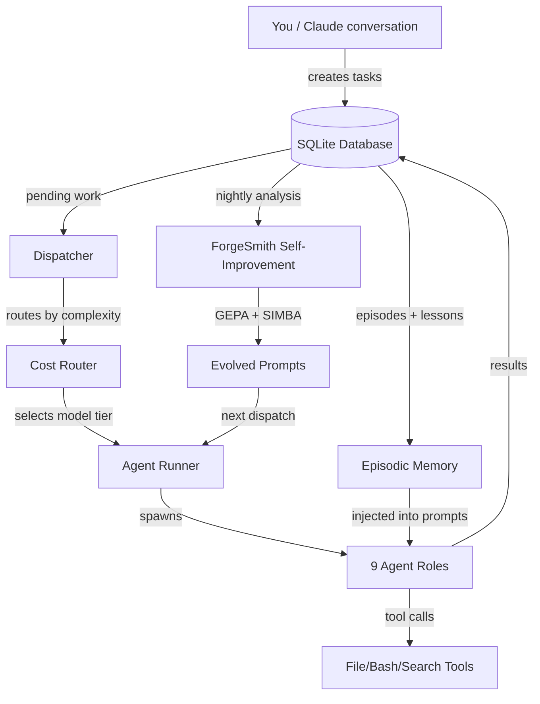
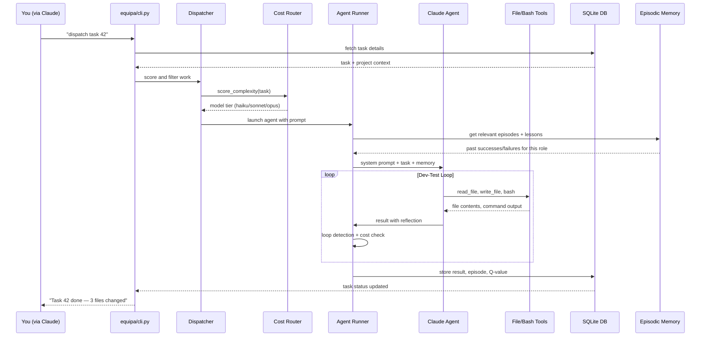
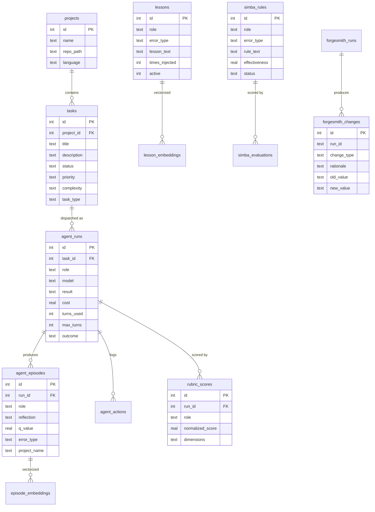

# ARCHITECTURE.md

## Table of Contents

- [ARCHITECTURE.md](#architecturemd)
  - [How It Works](#how-it-works)
  - [System Overview](#system-overview)
  - [Data Flow](#data-flow)
  - [Database](#database)
  - [Project Structure](#project-structure)
  - [Key Design Decisions](#key-design-decisions)
    - [Why zero dependencies?](#why-zero-dependencies)
    - [Why SQLite, not Postgres?](#why-sqlite-not-postgres)
    - [Why subprocess for Claude API calls?](#why-subprocess-for-claude-api-calls)
    - [The anti-compaction trick](#the-anti-compaction-trick)
    - [Prompt cache splitting](#prompt-cache-splitting)
    - [9 roles, not 1 generalist](#9-roles-not-1-generalist)
    - [Circuit breaker on model routing](#circuit-breaker-on-model-routing)
    - [Loop detection fingerprinting](#loop-detection-fingerprinting)
    - [Bash security is paranoid](#bash-security-is-paranoid)
    - [Self-improvement is a closed loop](#self-improvement-is-a-closed-loop)
  - [Current Limitations](#current-limitations)
  - [Related Documentation](#related-documentation)

## How It Works

You talk to Claude. That's it. You say "add pagination to the users API" and Claude breaks it down, dispatches agents, monitors progress, and tells you when it's done. Most users never touch a CLI.

Here's what happens under the hood when you ask for something:

1. **Claude receives your request** in plain conversation. It figures out what needs doing and creates tasks in the SQLite database.

2. **The dispatcher** (`equipa/dispatch.py`) picks up pending work, scores each task by project priority, and decides which agent roles to spin up. It also routes each task to the right AI model tier based on complexity — simple stuff gets the cheap model, gnarly stuff gets the expensive one.

3. **Agents get dispatched** — up to 9 specialized roles (developer, tester, security reviewer, planner, evaluator, etc.). Each agent gets a system prompt tailored to its role *and* the project's programming language. The prompts include lessons learned from past runs and episodic memory from similar tasks.

4. **The dev-test loop kicks in.** The developer writes code, the tester runs tests. If tests fail, the developer gets the failure context and tries again. This keeps going until tests pass or the budget runs out.

5. **Cost controls watch everything.** Each agent has a turn limit and a dollar cost ceiling that scales with task complexity. If an agent starts looping (doing the same thing over and over), the loop detector catches it and kills the run. Monologue detection kills agents that just talk without using tools.

6. **Results flow back to Claude**, who reports them to you in conversation. Task statuses update in the database. Agent episodes get recorded with reflections and Q-values for future reference.

7. **ForgeSmith runs on a schedule** (usually nightly via cron). It analyzes all recent agent runs, extracts lessons from failures, tunes configuration, and evolves prompts. Two subsystems — GEPA (prompt evolution) and SIMBA (situational rules) — feed into this. It takes 20-30 tasks before the self-improvement loop starts showing real patterns.

The whole thing runs on pure Python stdlib with SQLite. No pip install. No Docker. Copy the files, run setup, go.

---

## System Overview



---

## Data Flow

A typical task dispatch, from your words to working code:



---

## Database

The schema has 30+ tables. Here are the ones that matter most:



---

## Project Structure

```
equipa/                     # Core package — the engine
├── cli.py                  # Entry point. Parses args, dispatches work
├── dispatch.py             # Scans pending tasks, scores priorities, launches agents
├── routing.py              # Complexity scoring + model tier selection + circuit breaker
├── agent_runner.py         # Runs a single agent: retry logic, overload handling
├── prompts.py              # Builds system prompts with cache-splitting for cost savings
├── lessons.py              # Retrieves lessons + SIMBA rules for prompt injection
├── parsing.py              # Extracts reflections, test results, Q-values from agent output
├── monitoring.py           # Loop detection, monologue detection, budget warnings
├── bash_security.py        # 25+ checks for command injection before any bash execution
├── security.py             # Skill manifest integrity verification
├── tasks.py                # Task CRUD operations against SQLite
├── db.py                   # Database connection + schema management
├── messages.py             # Inter-agent messaging (agents can leave notes for each other)
├── checkpoints.py          # Anti-compaction state persistence for long tasks
├── hooks.py                # Event system for extensibility
├── mcp_server.py           # Model Context Protocol server for Claude Desktop
├── mcp_health.py           # Health monitoring for MCP server connections
├── embeddings.py           # Vector embeddings via Ollama for semantic memory
├── graph.py                # Knowledge graph: PageRank, label propagation on lessons
├── git_ops.py              # Language detection, repo setup
├── preflight.py            # Pre-dispatch checks (does the project even build?)
├── output.py               # Terminal formatting for dispatch summaries
├── tool_result_storage.py  # Large tool output persistence (avoids context overflow)
├── abort_controller.py     # Hierarchical cancellation (parent kills children)

forgesmith.py               # Self-improvement engine — analyzes runs, extracts lessons
forgesmith_gepa.py          # GEPA: Genetic Evolution of Prompt Architecture
forgesmith_simba.py         # SIMBA: Situational rules from failure patterns

scripts/
├── nightly_review.py       # Portfolio-level daily summary
├── analyze_performance.py  # Deep analytics on completion rates and throughput
├── autoresearch_loop.py    # Automated prompt optimization loop
├── forgesmith_backfill.py  # Backfill episode data from agent logs
├── forgesmith_impact.py    # Blast radius analysis for config changes

tools/
├── forge_dashboard.py      # Terminal dashboard for task/project overview
├── forge_arena.py          # Multi-phase convergence testing
├── prepare_training_data.py # Export data for fine-tuning
├── benchmark_migrations.py # DB migration testing

skills/                     # Agent skill definitions
├── security/               # SARIF parsing, static analysis helpers

prompts/                    # Role-specific prompt templates (per language)

tests/                      # 334+ tests, all pure pytest
├── test_early_termination.py  # Biggest test file — loop/monologue/cost detection
├── test_bash_security.py      # Extensive exploit coverage
├── test_loop_detection.py     # Fingerprinting and pattern detection
├── ...

db_migrate.py               # Schema migrations v0→v5 with automatic backups
equipa_setup.py             # Interactive setup wizard
ollama_agent.py             # Local Ollama model support (alternative to Claude)
```

---

## Key Design Decisions

### Why zero dependencies?
Copy the folder, run it. No virtualenv, no pip, no version conflicts. The stdlib has `sqlite3`, `json`, `subprocess`, `http.client` — that's enough. The only external call is to Claude's API (or Ollama) via subprocess/HTTP.

### Why SQLite, not Postgres?
Single file. No server to run. Backup is copying a file. The 30+ table schema sounds heavy but SQLite handles it fine for the scale this operates at — hundreds of tasks, not millions.

### Why subprocess for Claude API calls?
The agent runner shells out to `claude` CLI. This sounds weird but it means EQUIPA doesn't need an API key embedded — it piggybacks on your existing Claude CLI auth. It also means each agent run is an isolated process that can be killed cleanly.

### The anti-compaction trick
Claude's context window gets compacted on long conversations, losing important state. EQUIPA stores checkpoints to disk and re-injects them, so if compaction happens the agent doesn't lose track of what it was doing. This is noted in the system prompt itself — agents are told their state persists.

### Prompt cache splitting
`PromptResult` splits system prompts into a static part (role instructions, common rules) and a dynamic part (task details, lessons). The static part stays the same across tasks for the same role, so Anthropic's prompt caching kicks in and you pay less. It's a cost optimization that adds up fast.

### 9 roles, not 1 generalist
Specialized prompts beat general ones. A developer agent gets told to write code and use tools immediately. A tester agent gets told to run existing tests first. A security reviewer looks for specific vulnerability patterns. Each role has language-specific prompt additions (Python agents know about pytest, Go agents know about `go test`, etc.).

### Circuit breaker on model routing
If the expensive model (Opus) starts failing repeatedly, the circuit breaker trips and tasks get routed to a cheaper model. It recovers after 60 seconds. This prevents a bad API day from burning your budget.

### Loop detection fingerprinting
Every agent turn gets fingerprinted — result text, blockers, errors. If the same fingerprint repeats 3+ times, warning. 5+ times, terminated. There's also alternating pattern detection (agent bouncing between two states) and monologue detection (agent talking but not using tools). This is a bit gnarly — see `equipa/monitoring.py`.

### Bash security is paranoid
25+ checks before any bash command executes. Command substitution, brace expansion, IFS injection, zsh-specific exploits, Unicode homoglyphs, null bytes, process substitution.. the test file has real-world exploit patterns. An agent can't accidentally `rm -rf /` or exfiltrate data through `jq`.

### Self-improvement is a closed loop
ForgeSmith → GEPA (evolve prompts genetically) → SIMBA (extract situational rules from failure patterns) → lessons get injected into future agent runs → agent performance feeds back into ForgeSmith. Episodic memory uses Q-values that update on success/failure, so good strategies float up and bad ones sink. The knowledge graph adds PageRank-based reranking so the most connected and useful lessons surface first.

---

## Current Limitations

- **Agents still get stuck.** Complex tasks with ambiguous requirements can cause analysis paralysis — the agent reads and reads without writing code. Early termination kills these at 10 turns of reading, but some legitimate complex tasks genuinely need that exploration time.

- **Git worktree merges occasionally need manual intervention.** When agents work in parallel on separate branches, the merge back isn't always clean. This part is still being refined.

- **Self-improvement needs data.** GEPA and SIMBA need 20-30 completed tasks before meaningful patterns emerge. Before that, the system runs on its base prompts, which are decent but not tuned to your specific projects.

- **Tester role assumes your project has tests.** If there's no test suite to run, the tester agent doesn't have much to work with. It won't write a test framework from scratch (though it will add individual test files).

- **Early termination is a blunt instrument.** The 10-turn reading limit catches stuck agents but also kills agents that are doing legitimate deep analysis. There's no great way to distinguish "productively exploring" from "going in circles" yet.

- **It's not magic.** Agents still fail, get stuck, and waste turns sometimes. The system gets better over time, but expect maybe 70-80% success on well-defined tasks and lower on vague ones. The self-improvement loop helps, but slowly.
---

## Related Documentation

- [Readme](README.md)
- [Api](API.md)
- [Deployment](DEPLOYMENT.md)
- [Contributing](CONTRIBUTING.md)
