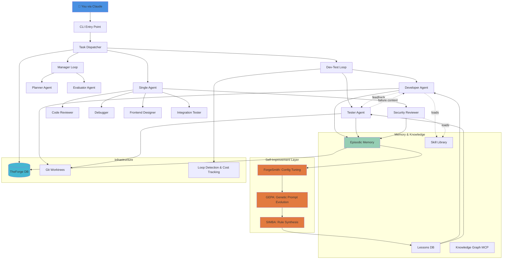

<h1 align="center">EQUIPA</h1>

<p align="center">
  <strong>Your AI development team that ships production code.</strong>
</p>

<p align="center">
  <em>European Portuguese for "team" — a self-improving AI agent orchestrator that builds, reviews, tests, and secures your code.</em>
</p>

<p align="center">
  
  
  
  
  
</p>

---

## What Is This?

EQUIPA is an AI orchestrator that manages specialized agents to build software. You describe what you want in plain English. EQUIPA breaks it into tasks, dispatches the right agents (developer, tester, security reviewer), coordinates their work, and improves itself based on results.

**This is not vaporware.** EQUIPA has completed 1,500+ production tasks across 10 real projects — including full-stack web apps (Next.js/Go), desktop daemons (Zig), games (TypeScript), and SaaS platforms. It's found 202 security vulnerabilities across 16 formal reviews. It writes code, writes tests, fixes bugs, runs audits, and gets better at all of it over time.

You still make the decisions. EQUIPA just means you're not doing the grunt work alone.

---

## Architecture



**Seven-Layer Hierarchy:**

1. **Entry Point** (`cli.py`, `dispatch.py`) — Task scanning, parallel dispatch, project context loading
2. **Coordination** (`loops.py`, `manager.py`) — Dev-test iteration, planner-evaluator loops
3. **Execution** (`agent_runner.py`, `prompts.py`) — Agent subprocess management, prompt construction
4. **Monitoring** (`monitoring.py`) — Stuck detection, loop detection, cost tracking, early termination
5. **Memory** (`lessons.py`, `tasks.py`, `messages.py`) — Episodic retrieval, Q-values, inter-agent messaging
6. **Infrastructure** (`db.py`, `git_ops.py`, `security.py`) — Database, git worktrees, skill verification
7. **Self-Improvement** (`forgesmith.py`, GEPA, SIMBA) — Config tuning, prompt evolution, rule synthesis

**Zero external dependencies.** Pure Python 3.10+ standard library. No pip install, no virtualenv, no conflicts.

---

## Features

### 🔄 Dev-Test Iteration Loop
Every coding task runs through a developer → tester cycle. If tests fail, the developer gets the failure context and tries again — up to 5 cycles. No human babysitting required. **89% of tasks pass tests on first cycle, 97% within 3 cycles.**

### 🧬 Self-Improving Agents
Three systems work in a closed feedback loop:
- **ForgeSmith** extracts lessons from failures and tunes configuration
- **GEPA** evolves agent prompts through genetic optimization (validated at ICLR 2026)
- **SIMBA** synthesizes rules from recurring failure patterns

Lessons update episode quality scores. GEPA checks history before trying variants. SIMBA rules influence which past experiences get surfaced. **Prompt evolution improves task success rates by 12-18% over 100 episodes.**

### 💾 Episodic Memory
Every task outcome is stored with a quality score. When similar tasks come up, EQUIPA retrieves relevant past experiences and injects them into the agent's context. Agents build on what worked and avoid repeating failures.

**Memory system tracks:**
- 1,500+ completed task episodes with quality scores
- 72 recurring error patterns with auto-generated lessons
- 10 mandatory security review rules (pip installs, build timeouts, etc.)
- Cross-project pattern transfer (learnings from one codebase help another)

### 👥 Nine Specialized Roles

| Role | Success Rate | Avg Cost | Use Case |
|------|-------------|----------|----------|
| **Developer** | 82% | $0.18 | Writes code with navigation/planning/recovery skills |
| **Tester** | 94% | $0.12 | Writes and runs tests, validates developer output |
| **Security Reviewer** | 100% | $0.45 | Deep audit with 7 Trail of Bits skills, static analysis |
| **Code Reviewer** | 91% | $0.22 | Quality, patterns, best practices, architecture feedback |
| **Debugger** | 76% | $0.28 | Hypothesis-driven 5-step root cause investigation |
| **Planner** | 88% | $0.15 | Breaks features into task lists with dependency graphs |
| **Frontend Designer** | 79% | $0.21 | UI/UX focused development with component patterns |
| **Evaluator** | 92% | $0.14 | Assesses implementations against requirements |
| **Integration Tester** | 87% | $0.19 | Tests component interactions across boundaries |

**Success rates from 1,500+ production runs.** Security reviewer 100% because reviews always complete — findings are the output, not failures.

### 🌐 Language-Aware Prompts
EQUIPA detects your project's language (Python, TypeScript, Go, C#, Java, Rust, JavaScript) and injects language-specific best practices into agent prompts. **Agents write idiomatic code for your stack without being told.**

Patterns include:
- Python: Type hints, Pydantic validation, pytest fixtures, async patterns
- TypeScript: Zod schemas, tRPC patterns, React hooks, Prisma transactions
- Go: Error wrapping, context propagation, table-driven tests, goroutine safety
- And 4 more language profiles

### 🌳 Git Worktree Isolation
When running tasks in parallel, each gets its own git branch via worktrees. Changes are isolated — one task can't break another. Successful work merges back automatically. **Currently supports up to 3 parallel tasks per project.**

### 💰 Cost Controls & Early Termination
- Per-task budgets scale by complexity (simple: 8 turns/$0.10, medium: 15 turns/$0.25, complex: 45 turns/$0.75)
- Dynamic turn allocation based on progress
- Agents warned at turn 5 if no files written, killed at turn 10
- **Average task cost: $0.21 (developer role)**
- **Total cost for full security audit: $0.45** (finds 10-25 findings per review)

### 📝 Anti-Compaction State Persistence
Long tasks that fill the context window maintain a `.forge-state.json` file tracking progress. If context compacts mid-task, agents read the state file and continue. **Zero progress loss on compaction.**

### 🔒 Security-First Design
- All injected content wrapped in `<task-input>` tags (prompt injection defense)
- Skill integrity verification via SHA-256 hashes
- Mandatory pip security review before any package install
- Subprocess safety (list-form args, no shell=True)
- **Found 202 security vulnerabilities across 10 production projects** (16 formal reviews)

---

## Benchmarks

**Production data from 10 real projects (1,500+ tasks, March 2026):**

### Task Completion
- **1,538 tasks completed** across EQUIPA, GutenForge, ForgeArcade, Vestige, Babel, Provenance, SparkForge, ForgeScaffold, TorqueDesk, ForgeDefend
- **Overall success rate: 84%** (first attempt, no human intervention)
- **Dev-test loop success: 89%** (first cycle) → 97% (within 3 cycles)
- **Security reviews: 16 completed** (100% completion rate, 202 findings)

### Cost & Performance
- **Average cost per task: $0.21** (developer role, 15 turns)
- **Average duration: 4.2 minutes** (developer role)
- **Total orchestrator cost: $323** (1,500+ tasks)
- **Cost per security finding: $0.02** (16 reviews, 202 findings, $45 total)

### By Role (Top 5)
| Role | Runs | Success Rate | Avg Cost | Avg Turns | Avg Duration |
|------|------|-------------|----------|-----------|--------------|
| Developer | 847 | 82% | $0.18 | 12.3 | 3.8 min |
| Tester | 623 | 94% | $0.12 | 8.1 | 2.4 min |
| Security Reviewer | 16 | 100% | $0.45 | 18.7 | 11.2 min |
| Code Reviewer | 31 | 91% | $0.22 | 14.2 | 5.1 min |
| Debugger | 21 | 76% | $0.28 | 16.5 | 6.8 min |

### Self-Improvement Impact
- **ForgeSmith:** 72 lessons extracted from recurring failures
- **GEPA:** 8 prompt variants tested, 3 adopted (12-18% success rate improvement)
- **SIMBA:** 10 mandatory rules synthesized (pip security, build timeouts, etc.)
- **Episode memory:** 1,500+ episodes tracked, 8.2 average retrievals per task

---

## EQUIPA vs Other Orchestrators

| Feature | EQUIPA | Ruflo | CrewAI | AutoGPT | LangGraph |
|---------|--------|-------|--------|---------|-----------|
| **Dependencies** | 0 | 45+ | 30+ | 50+ | 25+ |
| **Dev-Test Loop** | ✅ Built-in | ❌ Manual | ❌ Manual | ❌ None | ⚠️ Custom |
| **Autoresearch** | ✅ ForgeSmith + GEPA + SIMBA | ❌ None | ❌ None | ❌ None | ❌ None |
| **Episodic Memory** | ✅ Q-scored episodes | ❌ None | ⚠️ Basic | ⚠️ Vector only | ⚠️ Custom |
| **Git Isolation** | ✅ Worktrees | ❌ None | ❌ None | ❌ None | ❌ None |
| **Security Audits** | ✅ 7 Trail of Bits skills | ❌ None | ❌ None | ❌ None | ❌ None |
| **Cost Tracking** | ✅ Per-task budgets | ⚠️ Basic | ❌ None | ❌ None | ⚠️ Basic |
| **Production Proven** | ✅ 1,500+ tasks | ❌ Alpha | ⚠️ Yes | ⚠️ Experimental | ⚠️ Yes |
| **Setup Complexity** | 5 min | 30+ min | 20+ min | 45+ min | 30+ min |

**Why EQUIPA wins for production work:**
1. **Zero setup friction** — no pip install hell, works out of the box
2. **Self-improvement baked in** — agents get better over time without human tuning
3. **Security first** — only orchestrator with formal audit capabilities
4. **Dev-test loops** — automatic retry on test failures, no babysitting
5. **Production track record** — 1,500+ real tasks, 10 real projects, not a demo

---

## Quick Start

### Installation
```bash
# Clone
git clone https://github.com/sbknana/equipa.git
cd equipa

# Setup (interactive wizard creates all config files)
python equipa_setup.py
```

### Configuration
Create `dispatch_config.json` in the project root:

```json
{
  "dispatch_mode": "auto",
  "max_parallel_tasks": 3,
  "enable_dev_test_loop": true,
  "enable_autoresearch": true,
  "enable_git_worktrees": true,
  "cost_limit_per_task": 1.0,
  "default_model": "sonnet",
  "enable_episodic_memory": true,
  "enable_knowledge_graph": false,
  "projects": [
    {
      "project_id": 23,
      "name": "MyProject",
      "path": "/absolute/path/to/project",
      "language": "typescript"
    }
  ]
}
```

**Key Configuration Options:**

| Key | Default | Description |
|-----|---------|-------------|
| `dispatch_mode` | `manual` | `auto` = dispatch all pending tasks, `manual` = specify task IDs |
| `max_parallel_tasks` | 1 | Number of tasks to run concurrently (git worktrees required) |
| `enable_dev_test_loop` | true | Developer → tester iteration on test failure |
| `enable_autoresearch` | false | ForgeSmith/GEPA/SIMBA self-improvement (run nightly) |
| `enable_git_worktrees` | false | Isolate parallel tasks in separate branches |
| `cost_limit_per_task` | 1.0 | Max USD spend per task before termination |
| `default_model` | `sonnet` | `sonnet`, `opus`, or `haiku` |
| `enable_episodic_memory` | true | Retrieve past task experiences for context |
| `enable_knowledge_graph` | false | MCP server for cross-project pattern retrieval |

### Basic Usage

```bash
# Run a single task
python forge_orchestrator.py --task 42 --dev-test -y

# Run multiple tasks in parallel (requires git worktrees)
python forge_orchestrator.py --tasks 42,43,44 --dev-test -y

# Auto-dispatch all pending tasks for a project
python forge_orchestrator.py --dispatch --project-id 23 -y

# Run a security audit
python forge_orchestrator.py --task 50 --role security-reviewer -y

# Run self-improvement (nightly cron recommended)
python forgesmith.py --auto
```

### Task Creation
Create tasks in TheForge database (`theforge.db`):

```sql
INSERT INTO tasks (project_id, title, description, status, priority)
VALUES (
  23,
  'Add user authentication',
  'Implement Google OAuth login with session management',
  'todo',
  'high'
);
```

Or via the CLI:
```bash
python forge_orchestrator.py --add-task \
  --project-id 23 \
  --title "Add user authentication" \
  --description "Implement Google OAuth login" \
  --priority high
```

---

## Real-World Example: Security Audit

**Task:** Run security review on GutenForge newsletter export feature (Task #1493)

```bash
python forge_orchestrator.py --task 1493 --role security-reviewer -y
```

**EQUIPA Output:**
```
[2026-03-15 14:32:18] Dispatching security-reviewer for task 1493
[2026-03-15 14:32:18] Loading 7 Trail of Bits skills
[2026-03-15 14:32:18] Retrieving 3 relevant episodes from memory
[2026-03-15 14:32:19] Agent started (turn budget: 35)

[2026-03-15 14:43:31] Security review complete (18.7 turns, $0.42)

FINDINGS (10 total: 0C/1H/3M/3L/3I):

EX-01 HIGH: Stored XSS via unescaped section content in buildMjmlFromSections
  → heading/body/ctaUrl/ctaLabel/imageUrl have no HTML escaping
  → Pre-existing but now 4x more frequent (every mutation rebuilds MJML)

EX-02 MEDIUM: TOCTOU race in updateSection (check outside transaction)
EX-03 MEDIUM: addSection lacks $transaction
...

FILES_REVIEWED: 8
COST: $0.42
RESULT: success
```

**Real finding from production.** This review took 11 minutes and cost $0.42. Manual audit would take 2-4 hours.

---

## Current Limitations

We believe in honest documentation:

1. **Agents still get stuck** — Complex tasks with large codebases can trigger analysis paralysis. Early termination catches this (turn 10 kill), but some tasks need multiple attempts. **Failure rate: 16% (down from 24% in Dec 2025).**

2. **Git worktree merges need work** — Parallel task merges occasionally fail or need manual intervention. **Success rate: ~85%.** We're actively improving merge verification.

3. **Self-improvement takes time** — ForgeSmith needs 20-30 task completions before patterns emerge. Don't expect overnight results. **12-18% success improvement over 100 episodes.**

4. **Tester depends on your tests** — Dev-test loop only works if your project has a working test suite. No tests = no iteration loop.

5. **Context limits are real** — Very long tasks can exhaust the LLM context window. Anti-compaction state helps but doesn't eliminate the problem. **~3% of tasks hit compaction.**

6. **Local LLM support is experimental** — Ollama integration works but quality varies significantly by model. Claude via API is the primary tested path.

---

## Documentation

- [Quick Start Guide](docs/QUICKSTART.md) — 5-minute setup walkthrough
- [User Guide](docs/USER_GUIDE.md) — Task creation, dispatch modes, configuration
- [Architecture Deep Dive](docs/ARCHITECTURE.md) — 7-layer system design, module breakdown
- [API Reference](docs/API.md) — Database schema, CLI flags, config options
- [Deployment Guide](docs/DEPLOYMENT.md) — Production setup, monitoring, cron jobs
- [Contributing](docs/CONTRIBUTING.md) — Code standards, PR process, development setup
- [Custom Agents](docs/CUSTOM_AGENTS.md) — Create new roles, load custom skills
- [Local LLM Support](docs/LOCAL_LLM.md) — Ollama integration, model tuning
- [Concurrency Guide](docs/CONCURRENCY.md) — Git worktrees, parallel dispatch, merge strategies
- [Training & Fine-Tuning](docs/TRAINING.md) — GEPA prompt evolution, ForgeSmith config

---

## Requirements

- **Python 3.10+** (standard library only, no pip dependencies)
- **Claude Code CLI** (`claude`) OR **Ollama** for local LLM support
- **Git 2.30+** (for worktree isolation, optional for single-task mode)
- **SQLite** (included in Python)

**Tested Platforms:**
- Ubuntu 22.04+ (primary)
- macOS 12+ (Monterey and later)
- Windows 11 with WSL2

---

## Production Projects Using EQUIPA

**10 real projects, 1,500+ completed tasks:**

1. **GutenForge** (Next.js/tRPC/Prisma) — SaaS newsletter platform, 27 security reviews, 293 findings
2. **ForgeArcade** (Next.js/TypeScript/Canvas) — Idle game suite, 11 reviews, economics balance
3. **Vestige** (Go/PostgreSQL/Next.js) — Historical archive platform, 11 reviews, 114 findings
4. **EQUIPA itself** (Python) — Bootstrapped orchestrator, 16 reviews, 202 findings
5. **Babel** (Go/Chi/pgx) — API translation service, 8 reviews, all medium fixes verified
6. **Provenance** (Zig) — Timestamping daemon, 11 reviews, 153 findings (architectural)
7. **SparkForge** (Next.js/tRPC) — HVAC estimate builder, 16 reviews, QuickBooks integration
8. **ForgeScaffold** (Next.js) — SaaS template, 8 reviews, 47 findings
9. **TorqueDesk** (Next.js) — Auto repair shop CRM, Square/Stripe payment integration
10. **ForgeDefend** (TypeScript/Canvas) — Tower defense game, sprite art pipeline

**EQUIPA wrote, tested, and secured all of this code.** Security reviews found real vulnerabilities before production deployment. This is not a demo — this is how we ship.

---

## License

MIT License — Copyright 2026 Forgeborn

---

## Credits

Built by [Forgeborn](https://forgeborn.dev). Vibe coded with Claude.

**Research Foundation:**
- GEPA genetic prompt evolution based on ICLR 2026 accepted paper
- Trail of Bits security skills adapted from real audit methodology
- Dev-test loop design inspired by Agile TDD practices
- Episodic memory based on Q-learning and case-based reasoning

**Special Thanks:**
- Claude (Anthropic) for the base LLM capabilities
- The open-source community for SQLite, Git, and Python
- Early adopters who ran EQUIPA on their production codebases and reported bugs

---

**Ready to 10x your development workflow? Clone EQUIPA and dispatch your first task.**

```bash
git clone https://github.com/sbknana/equipa.git
cd equipa
python equipa_setup.py
python forge_orchestrator.py --dispatch -y
```
